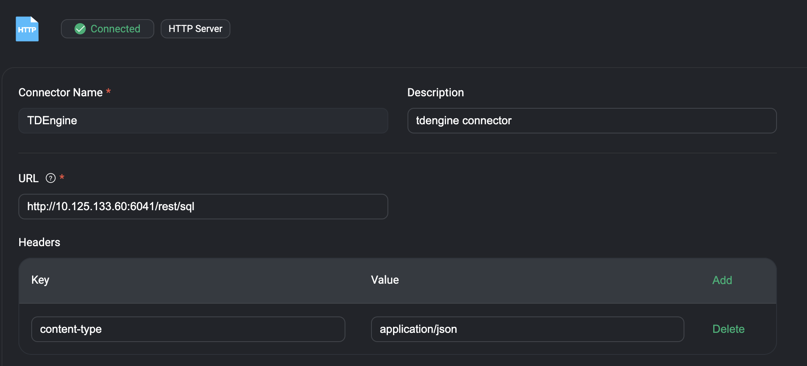
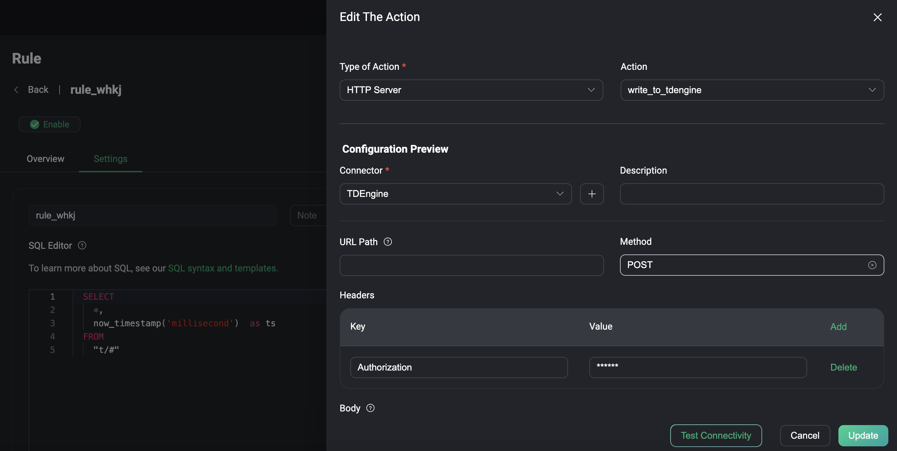

# EMQX MQTT broker and TDEngine on docker

This project simplifies the installation of TDEngine database and an EMQX MQTT broker

## Features

### Ingest MQTT Data into TDengine:
- EMQX supports integration with TDengine, allowing massive data transmission, storage, analysis, and distribution from numerous devices and data collectors.
- This integration provides real-time monitoring and early warning capabilities for business operations, offering valuable insights.
### How It Works:
- The integration combines EMQX’s real-time data capturing and transmission capabilities with TDengine’s data storage and analysis functionality.
- EMQX includes a built-in rule engine component that simplifies the process of ingesting data from EMQX to TDengine for storage and analysis.


## Installation

1. Clone this repository.
2. Run the docker compose file

## Usage

Store data from a specified MQTT topic to a TDEngine table:

###Create the database on TDEngine

```shell
# To start the TDengine docker image 
docker start tdengine_test

# Access the container
docker exec -it TDengine bash

# Locate the TDengine server in the container
taos
```
Once inside taos Create and then select the database:

```sql

CREATE DATABASE mqtt;

USE mqtt;
```

### Create Data Tables in TDengine

Before you create data bridges for TDengine, you need to create two data tables in TDengine database for message storage and status recording.

Use the following SQL statements to create data table t_mqtt_msg in TDengine database. The data table stores the client ID, topic, payload, and creation time of every message.
sql
```sql
   CREATE TABLE t_mqtt_msg (
       ts timestamp,
       msgid NCHAR(64),
       mqtt_topic NCHAR(255),
       qos TINYINT,
       payload BINARY(1024),
       arrived timestamp
     );
```
Use the following SQL statements to create data table emqx_client_events in TDengine database. This data table stores the client ID, event type, and creation time of every event.
sql

```sql
     CREATE TABLE emqx_client_events (
         ts timestamp,
         clientid VARCHAR(255),
         event VARCHAR(255)
       );
```

### Create a HTTP Connector to POST to the TDEngine RESTful API

1. Go to EMQX Dashboard, and click  connectors.
2. Click on Create on the top right corner of the page.
3. Set the url path to the TDEngine RESTful API (http://TDEngineIPAddress:6041/rest/sql) as shown bellow


### Create a Rule with TDengine Sink

This section demonstrates how to create a rules to specify the data to be saved into TDengine and recording client's online/offline status.

1. Go to EMQX Dashboard, and click Rules.
2. Click Create on the top right corner of the page.
3. Enter $Name as the rule ID, and set the rules in the SQL Editor based on the feature to use:
4. To create a rule for message storage, input the following statement, which means the MQTT messages under topic t/# will be saved to TDengine.

```sql
  SELECT
    *,
    now_timestamp('millisecond')  as ts
  FROM
    "t/#"
```


5. Click the + Add Action button to define an action that will be triggered by the rule. With this action, EMQX sends the data processed by the rule to TDengine.

6. Select HTTP Server from the Type of Action dropdown list.
7. Enter the name of the Action
8. Select the connector created before as the default connector for TDEngine
9. Save changes



### Test the Rule


## Contributing

Contributions are welcome! If you'd like to contribute, follow these steps:
1. Fork the repository.
2. Create a new branch.
3. Make your changes.
4. Submit a pull request.

## License

This project is licensed under the MIT License - see the LICENSE file for details.
